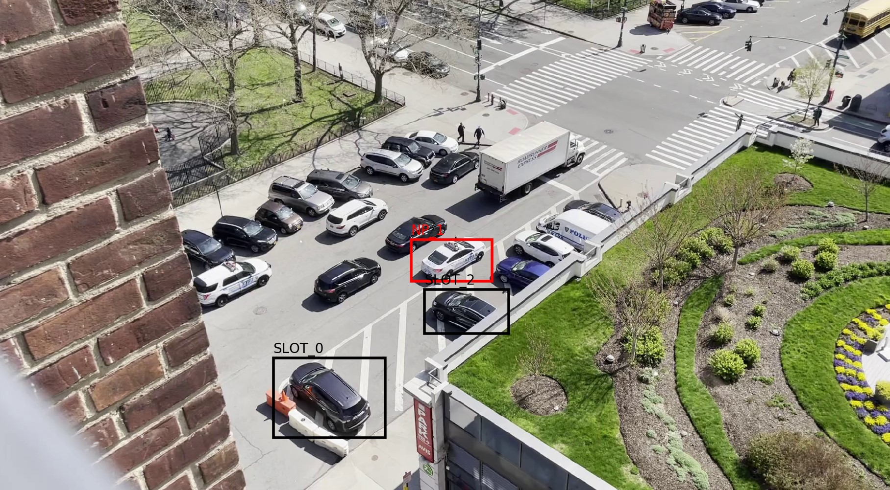

# Smart Parking Enforcement System 
## Zixuan Zhang, Haoran Zhu 

### Repo Structure 
The main program can be started by running the following command:
```
python main.py -vp VIDEO.mp4 -ap ANNOTATION.txt
```
Note that the annotation file must be provided by the user. We suggest using MakeSense(https://www.makesense.ai/) to 
specify allowed parking spaces and no-parking zones. 


```
- main.py: main program entrance
- vehicle_detector.py: train the vehicle detector 
- vehicle_signature.py: train the siamese network
- vehilcle_detection
    |- torch_detector.py: space occuptation detection
- vehicle_signature
    |- siamese.py: signature verification network
    |- contrasitive.py: definition of contrasitive loss
- system
    |- enforcement.py: enforcement logic 
    |- model_loader.py: how to load saved pytorch model into memory
    |- video_analyzer.py: do analysis on a given frame 
    |- video_streamer.py: sample input video and send frames to video_analyzer for detection
- utils
    |- some utility scripts such as callbacks, dataloaders
```
### Functionality
1. Empty space detection 
2. Parking time estimation 
3. No-parking zone violation detection 
4. Email notification when violation is detected 
For details, please refer to our project report: `report.pdf`
### Data Source
We use the CNRPark + EXT dataset as the source of the project: http://cnrpark.it/dataset/CNR-EXT-Patches-150x150.zip 
